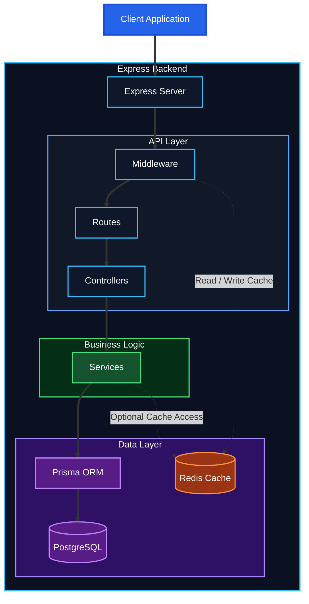
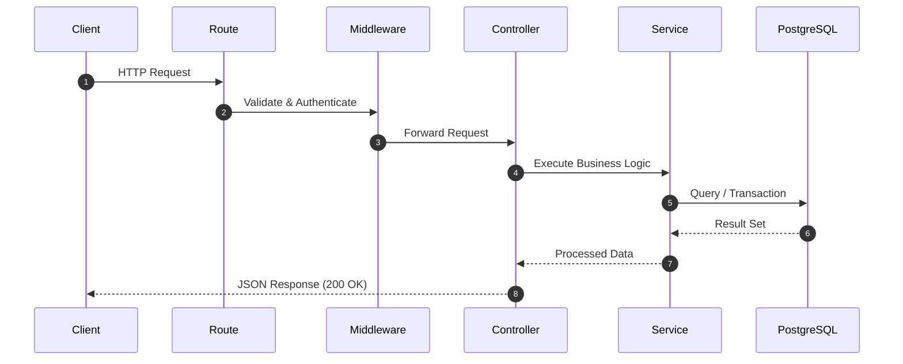
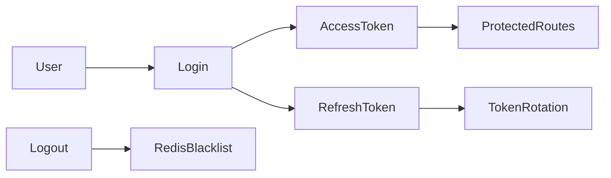
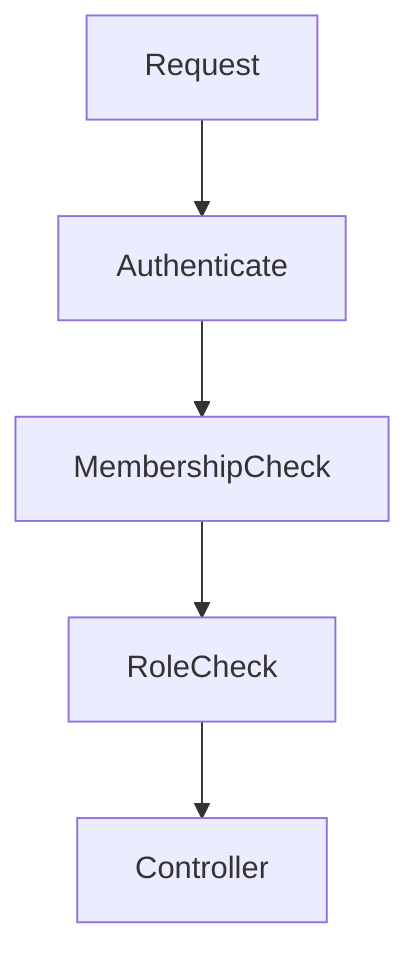
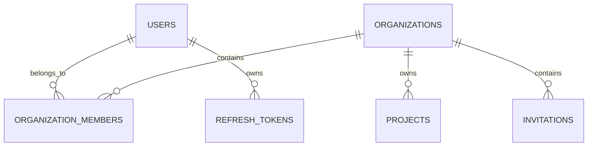

#   Architecture

## Overview

SaaS Workspace API is a production-ready backend built using modern SaaS architecture patterns.

### Features

*   JWT Authentication & Authorization
*   Refresh Token Rotation
*   Redis Caching & Token Blacklisting
*   Role-Based Access Control (RBAC)
*   Multi-Tenant Organization Management
*   Service Layer Architecture
*   PostgreSQL with Prisma ORM

### Architecture Flow

```text
Client → Routes → Middleware → Controllers → Services → Prisma → PostgreSQL
```

The application follows a layered architecture that promotes scalability, maintainability, and separation of concerns.

---

# High-Level System Architecture



---

# Request Lifecycle



---

# Application Layers

## Routes Layer

Responsibilities:

* Define API endpoints
* Apply middleware
* Forward requests to controllers

Example:

```text
/auth
/organizations
/projects
/invitations
```

---

## 🛡️ Middleware Layer

Handles security, validation, and request processing.

###  Authentication

* JWT verification
* User identification
* Token blacklist checks

###  Authorization

* Role validation
* Permission checks
* Organization access control

###  Validation

* Joi schema validation
* Input sanitization
* Request validation

###  Security

* Rate limiting
* Helmet headers
* CORS protection

###  Performance

* Redis caching
* Optimized request handling

###  Monitoring

* Request logging
* Error tracking

---

##  Controllers Layer

Controllers serve as the API entry point, handling HTTP requests and responses.

**Responsibilities**

* Extract request data
* Invoke service methods
* Return standardized responses
* Handle HTTP status codes

> Controllers remain thin and contain no business logic.

---

##  Services Layer

Services encapsulate the application's core business logic.

**Responsibilities**

* Execute business rules
* Manage database operations
* Handle transactions
* Enforce permissions and access control

**Core Services**

* Auth Service
* Organization Service
* Project Service

> Services act as the bridge between controllers and the database.

---

##  Database Layer

All database interactions are managed through Prisma ORM.

**Responsibilities**

* Data persistence
* Query execution
* Relationship management
* Schema migrations

**Database Engine**

```text
PostgreSQL
```

**ORM**

```text
Prisma
```

> Controllers → Services → Prisma → PostgreSQL

---

# Authentication Architecture



## Authentication Flow

1. User logs in.
2. Server validates credentials.
3. Access token is generated.
4. Refresh token is generated.
5. Access token is used for API requests.
6. Refresh token rotates when refreshed.
7. Logout blacklists tokens using Redis.

---

# RBAC Architecture

Roles are organization-specific.

A user can be:

* OWNER
* ADMIN
* MEMBER

inside one organization while having different permissions in another.



---

# Permission Matrix

| Action              | OWNER | ADMIN | MEMBER |
| ------------------- | ----- | ----- | ------ |
| View Organization   | ✅     | ✅     | ✅      |
| Update Organization | ✅     | ✅     | ❌      |
| Delete Organization | ✅     | ❌     | ❌      |
| Invite Members      | ✅     | ✅     | ❌      |
| Create Projects     | ✅     | ✅     | ❌      |
| Update Projects     | ✅     | ✅     | ❌      |
| Delete Projects     | ✅     | ✅     | ❌      |

---

# Database Architecture



Core entities:

* Users
* Organizations
* Organization Members
* Projects
* Invitations
* Refresh Tokens

---

# Folder Structure

```text
src/
├── config/
├── controllers/
├── middleware/
├── routes/
├── services/
├── validators/
├── utils/
├── app.js
└── server.js
```

### Responsibilities

| Folder      | Responsibility              |
| ----------- | --------------------------- |
| routes      | Endpoint definitions        |
| controllers | HTTP handling               |
| services    | Business logic              |
| middleware  | Authentication & validation |
| validators  | Joi schemas                 |
| config      | Application configuration   |
| utils       | Shared utilities            |

---

# Design Principles

## Separation of Concerns

Each layer has a single responsibility.

## Stateless Authentication

JWT reduces database lookups and improves scalability.

## Multi-Tenant Design

Organizations act as tenants while sharing infrastructure.

## Defense in Depth

Security is enforced through:

* JWT validation
* RBAC
* Rate limiting
* Input validation
* Redis token blacklisting

## Scalability

The architecture supports:

* Horizontal API scaling
* Independent service growth
* Database optimization
* Distributed authentication

---

# Technology Stack

| Component        | Technology      |
| ---------------- | --------------- |
| Runtime          | Node.js         |
| Framework        | Express.js      |
| Database         | PostgreSQL      |
| ORM              | Prisma          |
| Cache            | Redis           |
| Authentication   | JWT             |
| Validation       | Joi             |
| Documentation    | Swagger/OpenAPI |
| Containerization | Docker          |

---
